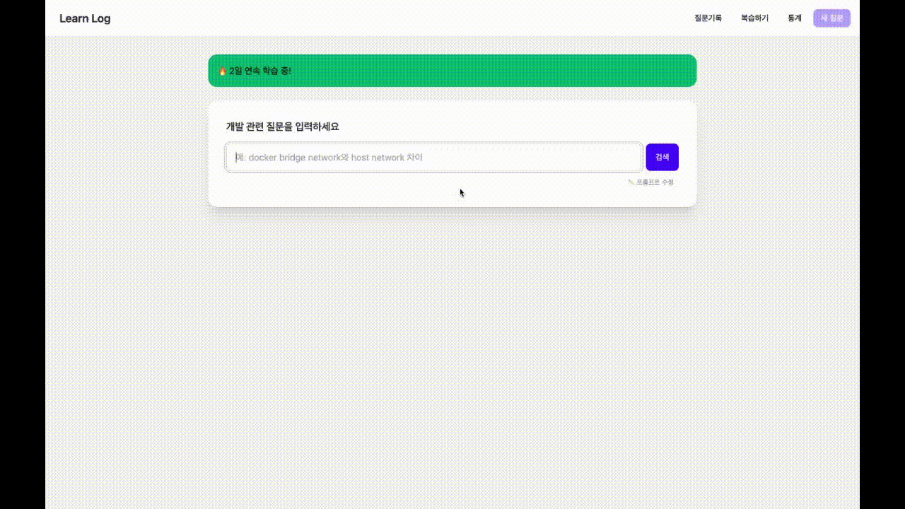
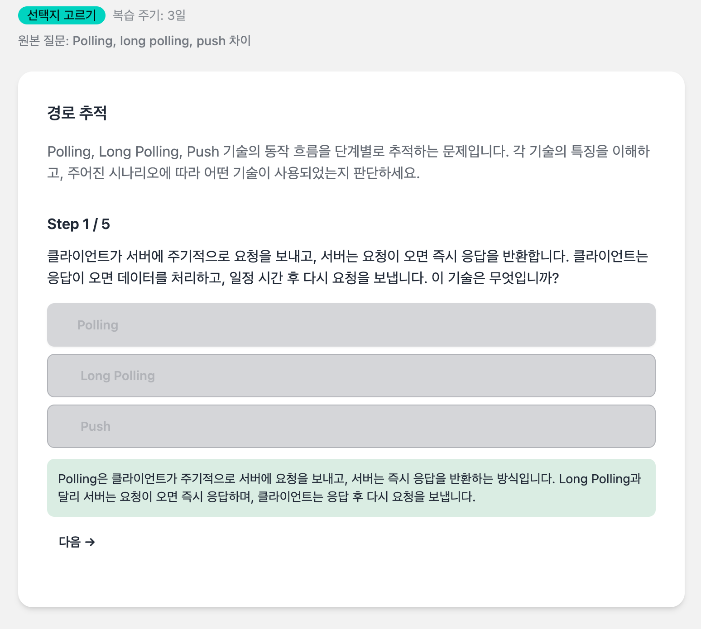
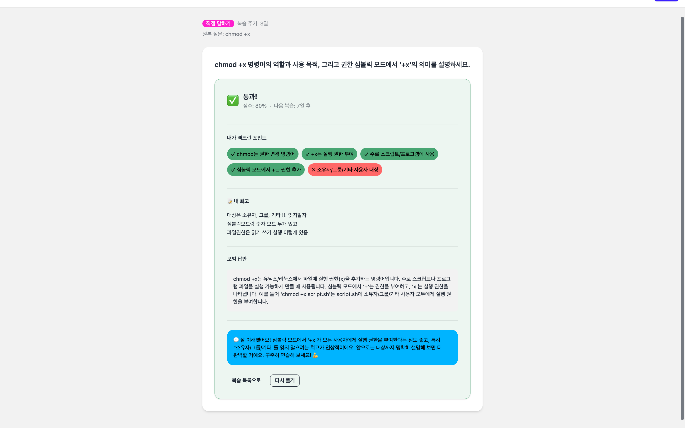
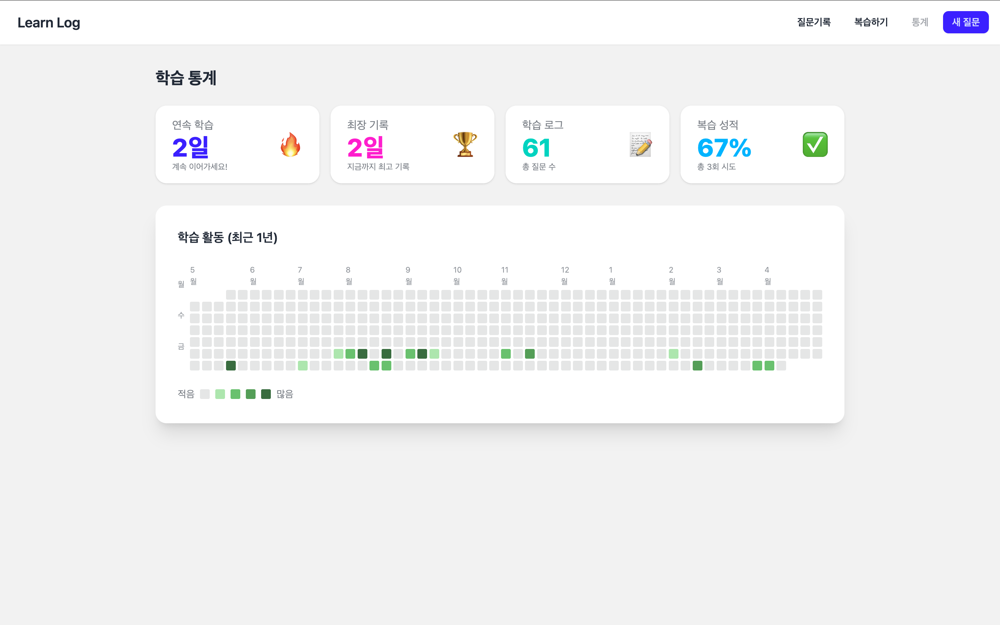
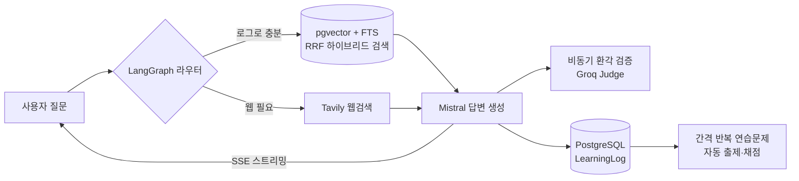

# LearnLog

개발 중 떠오른 기술 질문을 검색하면 AI가 공식 레퍼런스와 함께 답을 마크다운으로 정리해주고,
저장된 학습 로그로 간격 반복 연습문제를 자동 생성·채점해 복습까지 잇는 Django 학습 아카이브.

[배포 사이트](https://learn-log.onrender.com/) · [개발 노트](https://aengu.github.io/quartz-learnlog/)

남을 위한 서비스가 아니라 매일 직접 쓰는 개인 학습 도구로, 실제로 쓰며 느낀 불편을 개선으로 이어가고 있습니다.
(현재 학습 로그 61건, 연습문제 정답률 40%)

## 주요 기능

### AI 답변 + 공식 레퍼런스 자동 정리
질문을 입력하면 Tavily가 공식 문서를 찾고, Mistral이 답변을, Groq가 마크다운 변환을 맡아 레퍼런스가 포함된 한 문서로 정리합니다.



### 실시간 진행 스트리밍 (SSE)
답변이 생성되는 과정을 프로그레스바와 진행 로그로 실시간 전달합니다. (위 화면에서 진행 표시 확인 가능)

### 간격 반복 연습문제
저장한 학습 로그를 정말 이해했는지 점검하도록 LLM이 두 유형으로 출제하고, 1·3·7·14·30일 간격으로 복습 일정을 관리합니다.

선택지 고르기 — 단계별로 경로를 추적하며 정답을 고릅니다.



직접 답하기 — 자가 채점 체크리스트로 빠뜨린 포인트를 확인하고, 모범 답안·AI 피드백을 함께 제공합니다.



### 통계 대시보드 + Streak
학습량·정답률·연속 학습일수(Streak)를 잔디 스타일로 시각화합니다.



## 아키텍처



`Django 5 + DRF` · `HTMX + Tailwind/DaisyUI` · `PostgreSQL 18`(FTS + pgvector) · `Docker / Render / GitHub Actions`

## 주요 작업

| 영역 | 내용 | 결과 |
|------|------|------|
| 데이터 · 검색 | 모델·인덱스 설계, 한국어 FTS, pgvector 하이브리드 검색 | 키워드가 겹치지 않아도 의미로 검색 (추가 0.65s, 전체의 2%) |
| 배포 · 운영 | Docker Compose, Render 배포, DB 동기화·자동 백업, 워커 트러블슈팅 | push 시 자동 테스트 + DB 백업 자동화 |
| 테스트 · 검증 | pytest + factory-boy, 실험 스크립트 기반 회귀 검증 | 환각 오류율 10% → 5% → 0% |
| AI · 검색 파이프라인 | LangGraph 라우팅, RAG 파이프라인, 비동기 환각 검출 | 질문별 분기 + 응답을 막지 않는 검증 |
| 성능 · 실시간 | 병렬 API 호출·프롬프트 경량화, SSE 스트리밍 | 응답 68s → 37s |

## 개발 노트

빌드 과정의 설계 판단과 트러블슈팅을 글로 정리했습니다.

### 데이터 모델 · 검색
- [LearningLog 모델 필드 설계 — 자기참조 FK·verification·인덱스](https://aengu.github.io/quartz-learnlog/LearnLog/LearningLog-%EB%AA%A8%EB%8D%B8-%ED%95%84%EB%93%9C-%EC%84%A4%EA%B3%84)
- [Django 모델 설계 및 마이그레이션 초기화](https://aengu.github.io/quartz-learnlog/LearnLog/Django-%EB%AA%A8%EB%8D%B8-%EC%84%A4%EA%B3%84-%EB%B0%8F-%EB%A7%88%EC%9D%B4%EA%B7%B8%EB%A0%88%EC%9D%B4%EC%85%98-%EC%B4%88%EA%B8%B0%ED%99%94)
- [Full-Text Search — 한국어 키워드 검색](https://aengu.github.io/quartz-learnlog/LearnLog/%ED%95%99%EC%8A%B5%EB%A1%9C%EA%B7%B8-%EA%B2%80%EC%83%89-%EA%B8%B0%EB%8A%A5---Full-Text-Search-%EA%B5%AC%ED%98%84)
- [pgvector 하이브리드 RAG — FTS+벡터 RRF 결합](https://aengu.github.io/quartz-learnlog/LearnLog/pgvector-%ED%95%98%EC%9D%B4%EB%B8%8C%EB%A6%AC%EB%93%9C-RAG---FTS%2B%EB%B2%A1%ED%84%B0-RRF-%EA%B2%B0%ED%95%A9)
- [꼬리질문 — self-FK 질문 트리 구현](https://aengu.github.io/quartz-learnlog/LearnLog/%EA%BC%AC%EB%A6%AC%EC%A7%88%EB%AC%B8---self-FK-%EC%A7%88%EB%AC%B8-%ED%8A%B8%EB%A6%AC-%EA%B5%AC%ED%98%84)

### 배포 · 운영
- [Render 무료 배포 + DB 동기화 + 자동 백업](https://aengu.github.io/quartz-learnlog/LearnLog/Render-%EB%AC%B4%EB%A3%8C-%EB%B0%B0%ED%8F%AC-%2B-DB-%EB%8F%99%EA%B8%B0%ED%99%94-%2B-%EC%9E%90%EB%8F%99-%EB%B0%B1%EC%97%85-%EA%B5%AC%ED%98%84)
- [배포 웹 슬립 방지 — 콜드스타트 제거](https://aengu.github.io/quartz-learnlog/LearnLog/render-%EB%B0%B0%ED%8F%AC%EC%9B%B9-%EC%8A%AC%EB%A6%BD-%EB%B0%A9%EC%A7%80)
- [PostgreSQL 버전 불일치 — dbpull 실패](https://aengu.github.io/quartz-learnlog/LearnLog/PostgreSQL-%EB%B2%84%EC%A0%84-%EB%B6%88%EC%9D%BC%EC%B9%98-%ED%8A%B8%EB%9F%AC%EB%B8%94%EC%8A%88%ED%8C%85---dbpull-%EC%8B%A4%ED%8C%A8)
- [Gunicorn 워커 타임아웃 — 스트리밍 응답 SIGKILL](https://aengu.github.io/quartz-learnlog/LearnLog/Gunicorn-%EC%9B%8C%EC%BB%A4-%ED%83%80%EC%9E%84%EC%95%84%EC%9B%83-%ED%8A%B8%EB%9F%AC%EB%B8%94%EC%8A%88%ED%8C%85---%EC%8A%A4%ED%8A%B8%EB%A6%AC%EB%B0%8D-%EC%9D%91%EB%8B%B5-SIGKILL)
- [Docker 컨테이너 원격 디버깅 (VSCode·debugpy)](https://aengu.github.io/quartz-learnlog/LearnLog/vscode%EC%97%90%EC%84%9C-Docker-%EC%BB%A8%ED%85%8C%EC%9D%B4%EB%84%88-%EB%94%94%EB%B2%84%EA%B9%85%ED%95%98%EA%B8%B0)

### 테스트 · 검증
- [GitHub Actions CI — push/PR 자동 테스트](https://aengu.github.io/quartz-learnlog/LearnLog/GitHub-Actions%EB%A1%9C-%ED%85%8C%EC%8A%A4%ED%8A%B8%EC%9E%90%EB%8F%99%ED%99%94)
- [log list API 테스트 작성 (factory-boy)](https://aengu.github.io/quartz-learnlog/LearnLog/log-list-API-%ED%85%8C%EC%8A%A4%ED%8A%B8-%EC%9E%91%EC%84%B1)
- [검증 재설계 — pytest를 버리고 실험 스크립트로](https://aengu.github.io/quartz-learnlog/LearnLog/%ED%94%84%EB%A1%AC%ED%94%84%ED%8A%B8-%EA%B2%80%EC%A6%9D-%EC%9E%AC%EC%84%A4%EA%B3%84---pytest%EB%A5%BC-%EB%B2%84%EB%A6%AC%EA%B3%A0-%EC%8B%A4%ED%97%98-%EC%8A%A4%ED%81%AC%EB%A6%BD%ED%8A%B8%EB%A1%9C)
- [프롬프트 변경 효과 측정 — 오류율 비교](https://aengu.github.io/quartz-learnlog/LearnLog/%ED%94%84%EB%A1%AC%ED%94%84%ED%8A%B8-%EB%B3%80%EA%B2%BD-%ED%9A%A8%EA%B3%BC-%EC%B8%A1%EC%A0%95---correct_index-%EC%98%A4%EB%A5%98%EC%9C%A8-%EB%B9%84%EA%B5%90-%ED%85%8C%EC%8A%A4%ED%8A%B8)
- [런타임 가드 — 자가검증으로 환각 0% 수렴](https://aengu.github.io/quartz-learnlog/LearnLog/correct_index-%EB%9F%B0%ED%83%80%EC%9E%84-%EA%B0%80%EB%93%9C-%E2%80%94-%EC%9E%90%EA%B0%80%EA%B2%80%EC%A6%9D%EC%9C%BC%EB%A1%9C-%ED%99%98%EA%B0%81-0-percent%EC%97%90-%EC%88%98%EB%A0%B4)

### AI · 검색 파이프라인
- [RAG 검색 파이프라인 개선 — 한국어 질문 정확도](https://aengu.github.io/quartz-learnlog/LearnLog/RAG-%EA%B2%80%EC%83%89-%ED%8C%8C%EC%9D%B4%ED%94%84%EB%9D%BC%EC%9D%B8-%EA%B0%9C%EC%84%A0-%E2%80%94-%ED%95%9C%EA%B5%AD%EC%96%B4-%EC%A7%88%EB%AC%B8%EC%9D%B4-%EC%97%89%EB%9A%B1%ED%95%9C-%EA%B2%B0%EA%B3%BC%EB%A5%BC-%EB%B6%80%EB%A5%B4%EB%8D%98-%EB%AC%B8%EC%A0%9C)
- [LangGraph 라우팅 에이전트 — 질문별 조건 분기](https://aengu.github.io/quartz-learnlog/LearnLog/LangGraph-%EB%9D%BC%EC%9A%B0%ED%8C%85-%EC%97%90%EC%9D%B4%EC%A0%84%ED%8A%B8---%EC%A7%88%EB%AC%B8%EB%B3%84-%EC%A1%B0%EA%B1%B4-%EB%B6%84%EA%B8%B0)
- [환각 방어 — 예방·검출·표시 3단](https://aengu.github.io/quartz-learnlog/LearnLog/%ED%99%98%EA%B0%81-%EB%B0%A9%EC%96%B4---%EC%98%88%EB%B0%A9%C2%B7%EA%B2%80%EC%B6%9C%C2%B7%ED%91%9C%EC%8B%9C-3%EB%8B%A8)
- [LLM 공급자 하이브리드 전환 — Groq + Mistral](https://aengu.github.io/quartz-learnlog/LearnLog/LLM-%EA%B3%B5%EA%B8%89%EC%9E%90-%ED%95%98%EC%9D%B4%EB%B8%8C%EB%A6%AC%EB%93%9C-%EC%A0%84%ED%99%98---Groq-%2B-Mistral-%EC%86%8D%EB%8F%84%C2%B7%ED%92%88%EC%A7%88-%EB%B2%A4%EC%B9%98%EB%A7%88%ED%81%AC)
- [검색 도메인 자동 매핑 — 출처 판단 개선](https://aengu.github.io/quartz-learnlog/LearnLog/%EA%B2%80%EC%83%89-%EB%8F%84%EB%A9%94%EC%9D%B8-%EC%9E%90%EB%8F%99-%EB%A7%A4%ED%95%91---%EC%B6%9C%EC%B2%98-%ED%8C%90%EB%8B%A8-%EA%B0%9C%EC%84%A0)

### 성능 · 실시간
- [응답 속도 최적화 — 병렬·경량화·스트리밍 (68s→37s)](https://aengu.github.io/quartz-learnlog/LearnLog/LLM-%EC%9D%91%EB%8B%B5-%EC%86%8D%EB%8F%84-%EC%B5%9C%EC%A0%81%ED%99%94---%EB%B3%91%EB%A0%AC%ED%99%94%2C-%ED%94%84%EB%A1%AC%ED%94%84%ED%8A%B8-%EA%B2%BD%EB%9F%89%ED%99%94%2C-%EC%8A%A4%ED%8A%B8%EB%A6%AC%EB%B0%8D)
- [SSE 진행 스트리밍 — 프로그레스바·진행로그](https://aengu.github.io/quartz-learnlog/LearnLog/SSE-%EC%A7%84%ED%96%89-%EC%8A%A4%ED%8A%B8%EB%A6%AC%EB%B0%8D---%ED%94%84%EB%A1%9C%EA%B7%B8%EB%A0%88%EC%8A%A4%EB%B0%94%C2%B7%EC%A7%84%ED%96%89%EB%A1%9C%EA%B7%B8)

### 제품 · 기능
- [서비스 계층 설계 — 외부 API→가공→저장](https://aengu.github.io/quartz-learnlog/LearnLog/%ED%95%99%EC%8A%B5-%EB%A1%9C%EA%B7%B8-%EC%84%9C%EB%B9%84%EC%8A%A4-%EA%B3%84%EC%B8%B5-%EC%84%A4%EA%B3%84-%EB%B0%8F-%EA%B5%AC%ED%98%84)
- [간격 반복 연습문제 — 자동 출제·채점](https://aengu.github.io/quartz-learnlog/LearnLog/%EA%B0%84%EA%B2%A9-%EB%B0%98%EB%B3%B5-%EC%97%B0%EC%8A%B5%EB%AC%B8%EC%A0%9C---%EC%9E%90%EB%8F%99-%EC%B6%9C%EC%A0%9C%C2%B7%EC%B1%84%EC%A0%90)
- [통계 대시보드 + Streak — 잔디 시각화](https://aengu.github.io/quartz-learnlog/LearnLog/%ED%86%B5%EA%B3%84-%EB%8C%80%EC%8B%9C%EB%B3%B4%EB%93%9C-%2B-Streak%28%EB%B6%88%EA%BD%83%29-%EC%8B%9C%EC%8A%A4%ED%85%9C-%EA%B5%AC%ED%98%84)
- [메타인지 학습 UX 재설계 — 안 쓰는 기능 다시 만들기](https://aengu.github.io/quartz-learnlog/LearnLog/%EB%A9%94%ED%83%80%EC%9D%B8%EC%A7%80-%ED%95%99%EC%8A%B5-UX-%EC%9E%AC%EC%84%A4%EA%B3%84---%EC%95%88-%EC%93%B0%EB%8A%94-%EA%B8%B0%EB%8A%A5%EC%9D%84-%EB%8B%A4%EC%8B%9C-%EB%A7%8C%EB%93%A4%EA%B8%B0)

### CS · 개념 노트
- [싱글턴 패턴 — Streak 모델 적용](https://aengu.github.io/quartz-learnlog/LearnLog/%EC%8B%B1%EA%B8%80%ED%84%B4-%ED%8C%A8%ED%84%B4---Streak-%EB%AA%A8%EB%8D%B8-%EC%A0%81%EC%9A%A9)
- [LLM 추론 — 입력은 싸고 출력이 비싸다](https://aengu.github.io/quartz-learnlog/LearnLog/LLM-%EC%B6%94%EB%A1%A0%EC%97%90%EC%84%9C-%EC%9E%85%EB%A0%A5%EC%9D%80-%EC%8B%B8%EA%B3%A0-%EC%B6%9C%EB%A0%A5%EC%9D%B4-%EB%B9%84%EC%8B%B8%EB%8B%A4)

## 데이터 모델

| 모델 | 역할 | 비고 |
|------|------|------|
| `LearningLog` | 학습 로그(질문·AI답변·마크다운) | 자기참조 FK(`parent`)로 꼬리질문 트리, `verification` 검증 상태, `created_at`·`query`·`is_bookmarked` 인덱스 |
| `Reference` | 답변 근거가 된 공식 문서 | URL unique, 발췌·출처 타입 |
| `Exercise` / `ExerciseAttempt` | 간격 반복 연습문제·채점 기록 | `content` JSONField, `next_review_at` 인덱스 |
| `Streak` / `DailyJournal` | 연속 학습일수·일일 일지 | `signals.py` `post_save`로 자동 갱신 |

## 실행

```bash
docker compose up -d                              # 로컬 실행
docker compose exec web pytest                    # 테스트
docker compose exec web python manage.py migrate  # 마이그레이션
docker compose exec web python manage.py dbpull   # Render → 로컬 DB 동기화
```

`.env`에 `GROQ_API_KEY` · `MISTRAL_API_KEY` · `TAVILY_API_KEY` · `DATABASE_URL` 필요.

## 프로젝트 구조

```
search/
├── models.py          # LearningLog, Exercise, ExerciseAttempt, Streak, DailyJournal
├── api_views.py       # 질문 생성·채점 API (DRF)
├── views.py           # 페이지 뷰 (HTMX 부분 렌더)
├── services/          # 비즈니스 로직
│   ├── search_agent.py     # LangGraph 라우팅 + 검색 파이프라인
│   ├── learnlog_service.py # 로그 생성·검색(FTS/pgvector)
│   ├── exercise_service.py # 연습문제 출제·채점
│   └── journal_service.py  # Streak·일일 일지
├── experiments/       # 회귀 검증 실험 스크립트
├── tests/             # pytest + factory-boy
├── signals.py         # Streak 자동 갱신 (post_save)
└── templates/         # DaisyUI 컴포넌트 + HTMX
```

## 기술 스택

`Django 5` · `DRF` · `PostgreSQL 18`(FTS·pgvector) · `HTMX` · `Tailwind`·`DaisyUI` · `LangGraph` · `Groq`·`Mistral`·`Tavily` · `Docker Compose` · `Gunicorn`·`whitenoise` · `pytest`·`factory-boy` · `GitHub Actions` · `Render`
